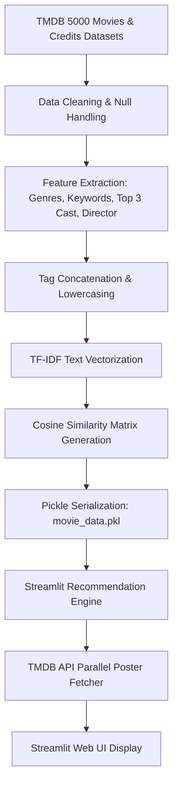
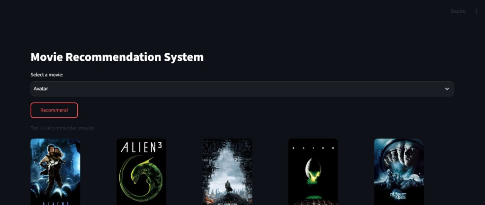
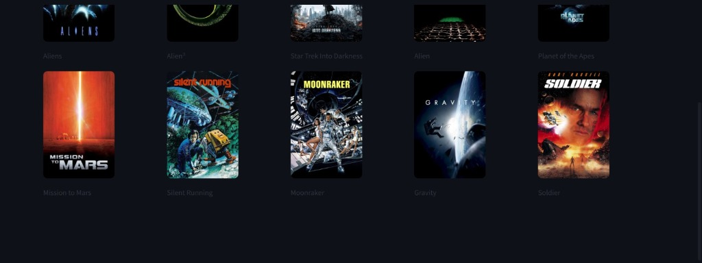

#  Movie Recommendation System

A content-based Movie Recommendation System that suggests movies similar to a user-selected title. Built with **Python**, **Scikit-learn**, and **Streamlit**, the application leverages TMDB metadata, converts metadata tags into numerical feature vectors using **TF-IDF Vectorization**, and computes similarity scores using **Cosine Similarity**. High-resolution movie posters are retrieved concurrently via the **TMDB API**.

---

##  Quick Links

-  **Live Application**: [https://movierecommendationsystem-awsfzsgrrgfcgh2elpcvg9.streamlit.app/](https://movierecommendationsystem-awsfzsgrrgfcgh2elpcvg9.streamlit.app/)
- 💻 **GitHub Repository**: [https://github.com/Anandakrishnna/MovieRecommendationSystem](https://github.com/Anandakrishnna/MovieRecommendationSystem)

---

##  Key Features

- **Content-Based Recommendation Engine**: Recommends movies by analyzing metadata proximity across genres, keywords, top cast members, and directors.
- **TF-IDF Text Vectorization**: Transforms unstructured textual metadata into high-dimensional vector representations while penalizing overly frequent words.
- **Cosine Similarity Matrix**: Computes pairwise cosine distance vectors across 4,800+ movies to rank similarities accurately.
- **Parallel Poster Fetching**: Accelerates poster loading using Python's `concurrent.futures.ThreadPoolExecutor` for non-blocking concurrent HTTP requests.
- **Intelligent Caching**: Uses Streamlit `@st.cache_resource` for static model loading and `@st.cache_data` for API poster request memoization.
- **Cinema-Inspired Dark UI**: Features a sleek, responsive dark theme UI with poster hover animations and fallback image handling.

---

##  How It Works

The recommendation pipeline converts raw movie metadata into similarity scores through the following architecture:



### Technical Workflow
1. **Data Ingestion & Merging**: Joins `tmdb_5000_movies.csv` and `tmdb_5000_credits.csv` on movie titles.
2. **Feature Extraction**: Parses JSON string columns using Python's `ast.literal_eval` to extract relevant genres, key plot tags, top 3 main actors, and directors.
3. **Tag Aggregation**: Combines all extracted strings into a unified `tags` document per movie and normalizes text to lowercase.
4. **Vectorization**: Transforms text documents into TF-IDF sparse matrix representations.
5. **Similarity Matrix**: Constructs a pairwise Cosine Similarity matrix ($4809 \times 4809$) representing inter-movie metadata distances.

---

##  Recommendation Approach

### 1. Feature Engineering
Movie attributes are combined into a single text representation:
- **Genres**: e.g., `["Action", "Adventure", "Science Fiction"]`
- **Keywords**: Plot keywords such as `["space war", "future", "colony"]`
- **Cast**: Top 3 credited actors, e.g., `["Sam Worthington", "Zoe Saldana", "Sigourney Weaver"]`
- **Crew**: Movie Director(s), e.g., `["James Cameron"]`

### 2. TF-IDF Text Vectorization
Unlike basic term frequency counts, **TF-IDF (Term Frequency - Inverse Document Frequency)** assigns weights to terms based on their uniqueness across the corpus:

$$ \text{TF-IDF}(t, d, D) = \text{TF}(t, d) \times \log\left(\frac{N}{\text{DF}(t)}\right) $$

This ensures common words (e.g., "man", "movie") receive lower weights while distinctive descriptors (e.g., "superhero", "cyberpunk") carry higher predictive weight.

### 3. Cosine Similarity Calculation
The similarity between two movie vector representations $\vec{A}$ and $\vec{B}$ is determined by the cosine of the angle between them:

$$ \text{Cosine Similarity}(\vec{A}, \vec{B}) = \frac{\vec{A} \cdot \vec{B}}{\|\vec{A}\| \|\vec{B}\|} = \frac{\sum_{i=1}^{n} A_i B_i}{\sqrt{\sum_{i=1}^{n} A_i^2} \sqrt{\sum_{i=1}^{n} B_i^2}} $$

- A value of **1.0** indicates identical metadata tags.
- A value of **0.0** indicates no shared metadata terms.

### 4. Ranking & Selection
When a user selects a movie:
1. The app locates the index of the selected title in the dataset.
2. It retrieves the corresponding row from the precomputed $4809 \times 4809$ similarity matrix.
3. It sorts all similarity scores in descending order and extracts indices 1 to 10 (excluding index 0, which is the queried movie itself).
4. Metadata and poster URLs for these top 10 movies are rendered in the interface.

---

##  Streamlit Application Interface

The web interface provides an intuitive user journey:
1. **Movie Selection**: Select any movie title from the searchable dropdown menu.
2. **Recommendation Request**: Click the **Get Recommendations** button to trigger the similarity query.
3. **Poster Retrieval**: The application asynchronously queries the TMDB REST API for poster artwork using `ThreadPoolExecutor`.
4. **Grid Display**: Top 10 recommendations are rendered in a clean 2x5 interactive poster grid.

---

##  Screenshots

> [!NOTE]
> Add application screenshots to the `screenshots/` directory to display visual previews.

| Home Interface | Recommendations View |
| :---: | :---: |
|  |  |

---

##  Tech Stack

| Technology | Role & Purpose |
| :--- | :--- |
| **Python 3.10+** | Core programming language |
| **Pandas** | Data manipulation, merging, and tabular cleaning |
| **NumPy** | Numerical array structures for matrix operations |
| **Scikit-learn** | `TfidfVectorizer` and `cosine_similarity` algorithms |
| **Streamlit** | Interactive web application framework |
| **Requests** | HTTP client for TMDB API communication |
| **ThreadPoolExecutor** | Parallel thread pool execution for poster retrieval |
| **Git & Git LFS** | Version control & large binary artifact tracking |

---

##  Project Structure

```text
MovieRecommendationSystem/
│
├── app.py                             # Main Streamlit web application & UI layout
├── Movie_Recommendation_System.ipynb  # Jupyter notebook (Data cleaning, EDA, vectorization)
├── movie_data.pkl                     # Serialized DataFrame & precomputed Cosine Similarity matrix
├── tmdb_5000_movies.csv               # Raw TMDB movies dataset (4,800+ entries)
├── tmdb_5000_credits.csv              # Raw TMDB credits dataset (cast & crew metadata)
├── requirements.txt                   # Application Python dependencies
├── README.md                          # Project documentation
├── .gitignore                         # Version control exclusions (secrets, venv, pycache)
└── screenshots/                       # Application screenshot assets
    └── .gitkeep
```

---

##  Installation & Local Setup

### 1. Clone the Repository
Ensure [Git LFS](https://git-lfs.com/) is installed to pull the serialized model binary (`movie_data.pkl`):

```bash
git lfs install
git clone https://github.com/Anandakrishnna/MovieRecommendationSystem.git
cd MovieRecommendationSystem
```

### 2. Set Up Virtual Environment

**Windows**:
```bash
python -m venv .venv
.venv\Scripts\activate
```

**macOS / Linux**:
```bash
python3 -m venv .venv
source .venv/bin/activate
```

### 3. Install Dependencies
```bash
pip install -r requirements.txt
```

### 4. Configure TMDB API Key (Optional for Live Posters)
To fetch live movie posters from TMDB:
1. Register for an API key at [The Movie Database (TMDB)](https://www.themoviedb.org/).
2. Create a `.streamlit/secrets.toml` file in the project root:

```toml
TMDB_API_KEY = "your_actual_tmdb_api_key_here"
```

> [!WARNING]
> Never commit `.streamlit/secrets.toml` to public repositories. Ensure it remains in `.gitignore`. If no key is configured, high-resolution fallback visuals will be displayed automatically.

---

##  Running the App Locally

Execute the Streamlit application runner:

```bash
streamlit run app.py
```

Open your browser and navigate to:
```text
http://localhost:8501
```

---

##  Deployment

The application is deployed on **Streamlit Community Cloud**:
- Deployed Live App: [https://movierecommendationsystem-awsfzsgrrgfcgh2elpcvg9.streamlit.app/](https://movierecommendationsystem-awsfzsgrrgfcgh2elpcvg9.streamlit.app/)
- **Deployment Note**: The precomputed similarity matrix (`movie_data.pkl`) is loaded directly into memory at app boot, enabling sub-second recommendation response times without runtime matrix re-computation.

---

##  Project Scope & Limitations

- **Content-Based Nature**: Recommendations are derived purely from metadata similarity (genres, plot keywords, cast, director). The system does not capture user rating preferences or collaborative behavior ("users who watched X also watched Y").
- **Dataset Boundaries**: The system covers movies present in the TMDB 5000 dataset (~4,800 movies up to 2017). Newly released movies require dataset updates and matrix re-computation.
- **Text Representation**: TF-IDF vectorization operates on exact word matches rather than contextual semantic embeddings.

---

##  Future Improvements

- **Hybrid Filtering**: Integrate Collaborative Filtering (User-Item Matrix Factorization or LightFM) with Content-Based scores.
- **Semantic Embeddings**: Upgrade text representations from TF-IDF to dense transformer embeddings (`all-MiniLM-L6-v2` via SentenceTransformers).
- **Interactive Filtering**: Allow users to filter recommendations by release year range, minimum rating, or preferred genre.
- **Explainable Recommendations**: Highlight matching tags (e.g., "Recommended because you liked movies directed by Christopher Nolan").

---

##  Learning Outcomes

This project demonstrates core competencies in:
- End-to-end Machine Learning workflow (data cleaning -> feature engineering -> similarity modeling -> pickle serialization).
- Natural Language Processing (NLP) text vectorization via TF-IDF.
- Cosine similarity distance metric implementation.
- REST API integration & concurrent asynchronous I/O (`ThreadPoolExecutor`).
- Modern web application engineering using Streamlit and custom CSS styling.

---

## 👤 Author

**Ananda Krishna**
- **GitHub**: [https://github.com/Anandakrishnna](https://github.com/Anandakrishnna)
- **Project Repository**: [https://github.com/Anandakrishnna/MovieRecommendationSystem](https://github.com/Anandakrishnna/MovieRecommendationSystem)
